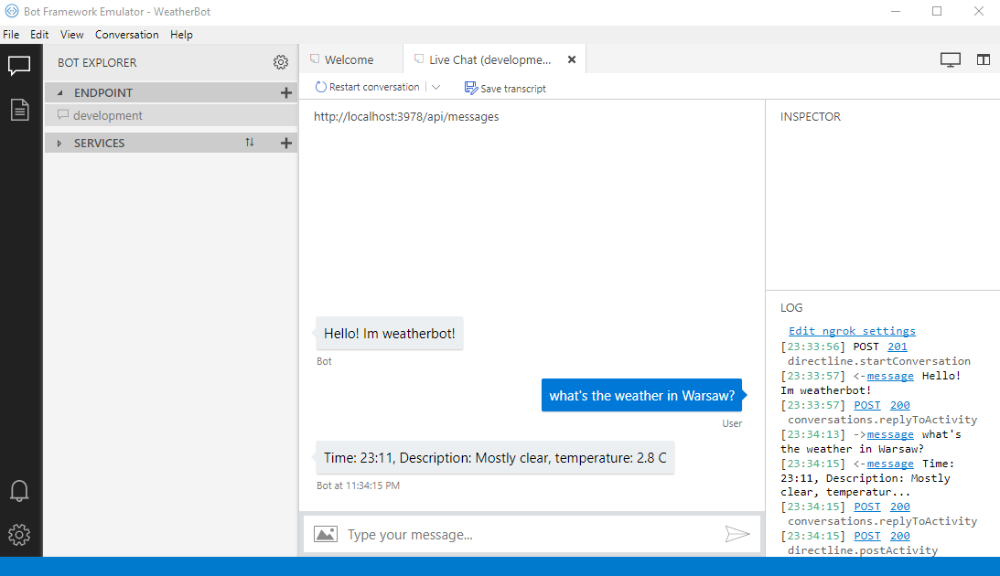

# WeatherBot

### PL:
Pogodynkobot (Pogodobot?) 
Przedstawia się i mówi, jaka jest pogoda w danym miejscu. 
Wykorzystuje: 
+ [MS Bot Framework](https://dev.botframework.com/)
+ [AccuWeather Api](https://developer.accuweather.com/)

Generalnie angielskojęzyczny (jak Api AccuWeather). 
Nazwy niektórych polskich miast są tłumaczone na angielski - spis w pliku locations.json. 
Przykład: 
"Jak pogoda w białymstoku?" -> Bot wyłapie słowo "białymstoku" -> znajdzie taki klucz w pliku locations.json i pobierze wartość dla tego klucza ("Bialystok"). 
Ze słowem "Bialystok" AccuWeather już powinno sobie poradzić. 

  
Dzięki dla zespołu z [geotechnology](https://www.geotechnology.pl/) za pomysł!

   
### EN:
Weatherbot 
Introduces itself and tells what's the weather in specified place. 
Makes use of: 
+ [MS Bot Framework](https://dev.botframework.com/)
+ [AccuWeather Api](https://developer.accuweather.com/)

  
Thanks for [geotechnology](https://www.geotechnology.pl/) team for that idea!

   

